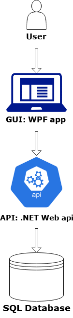

# HotelResFE

## Kom igång

- Ladda ned repot från github.
- Öppna solution-filen i visual studio 2019.
- [Konfigurera anslutningssträngar](#Konfigurering-av-applikation)
- Se till att API:t är igång och kontaktbart.
- Kör programmet.
- Registrera en ny användare, eller logga in med en användare som finns i den seedade databasen.

## Komponenter

- Programmet är skrivet i språket C# och XAML.
- Programmet är en WPF-applikation som är strukturerad med MVVM som designmönster. 
- prgrammet har följande paket tillagda:
    - Prism.Unity v8.1.97
    - newtonsoft.json v13.0.1

- programmet är en del av en större arkitektur. Detta är en klient som hämtar från och skickar till ett API:



##  För en applikation i produktion

### Driftmiljöer för denna applikation

Detta program är inte klart för produktionssättning. Det bör, tills det är klarskrivet __*endast*__ användas i test-/utvecklingsmiljö! 
Framför allt bör programmet vidareutvecklas i samförstånd med UX-designer för att färdigställa programmet för konsumenter.

### Konfigurering av applikation

Konfigureringen av detta program behöver just nu att man går in i alla service-klasser och manuellt skriver in vilken bas-URL ska vara. (Se ReadMe för HotelResAPI för att veta vilken url den använder.)
Exempel:
```
            public UserService(HttpClient httpClient)
        {
            _client = httpClient;
            _baseUrl = "https://localhost:44364/api";
            

        }
```

För vidare utveckling rekommenderas att man lägger in en dependencyinjektion för httpclient, med IHttpClientFactory. Det gör hanteringen av url och tokens mer centraliserad.

